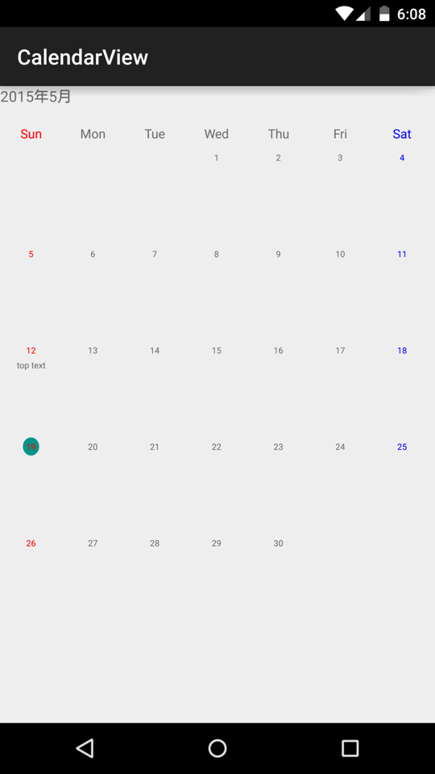

ExtendedCalendarView
----------------------------

## TODO


## Usage

if you create cell view, you must set adapter impliments `ExtendedCalendarViewAdapter`.  
like a `ListView Adapter`.

```
public class DefaultExtendedCalendarViewAdapter implements ExtendedCalendarViewAdapter {

    private final Context mContext;

    public DefaultExtendedCalendarViewAdapter(Context mContext) {
        this.mContext = mContext;
    }

    @Override
    public View getCellView(int month, int date, @ExtendedCalendarView.DayType int type, @Nullable View convertCell, @NonNull ViewGroup viewGroup) {
        ECCalendarCell v;
        if (convertCell == null) {
            v = (ECCalendarCell) LayoutInflater.from(mContext).inflate(R.layout.ecv_view_cell, viewGroup, false);
        } else {
            v = (ECCalendarCell) convertCell;
        }
        if (type != ExtendedCalendarView.DAY_TYPE_EMPTY) {
            v.getDateText().setText(String.valueOf(date));
        }
        switch (type) {
            case ExtendedCalendarView.DAY_TYPE_SATURDAY:
                v.getDateText().setTextColor(Color.BLUE);
                break;
            case ExtendedCalendarView.DAY_TYPE_SUNDAY:
                v.getDateText().setTextColor(Color.RED);
                break;
            case ExtendedCalendarView.DAY_TYPE_TODAY:
                break;
        }
        return v;
    }

    @Override
    public void resetCell(View cell) {
        ECCalendarCell v = (ECCalendarCell) cell;
        v.setDateText("");
        v.setTopText("");
        v.setMiddleText("");
        v.setBottomText("");
    }
}
```


activity_main.xml

```
<LinearLayout xmlns:android="http://schemas.android.com/apk/res/android"
              android:orientation="vertical"
              android:layout_width="match_parent"
              android:layout_height="match_parent">
    <org.yohei.extendedcalendarview.widget.ExtendedCalendarView
        android:id="@+id/calendar"
        android:paddingTop="16dp"
        android:layout_width="match_parent"
        android:layout_height="match_parent"/>
</LinearLayout>
```

MainActivity.java


```
public class MainActivity extends Activity {

    @Override
    protected void onCreate(Bundle savedInstanceState) {
        super.onCreate(savedInstanceState);
        setContentView(R.layout.activity_main);
        final TextView yearMonth = (TextView) findViewById(R.id.year_month);
        final ExtendedCalendarView extendedCalendarView = (ExtendedCalendarView) findViewById(R.id.calendar);
        // set your Adapter.
        extendedCalendarView.setAdapter(new DefaultExtendedCalendarViewAdapter(this));
        extendedCalendarView.setMonth(2015, 4);
        yearMonth.setText(DateUtils.formatDateTime(this, extendedCalendarView.getCurrentCalendar().getTimeInMillis(), DateUtils.FORMAT_SHOW_YEAR | DateUtils.FORMAT_NO_MONTH_DAY));
        // Cell Click Event
        extendedCalendarView.setOnCalendarCellViewClickListener(new ExtendedCalendarView.OnCalendarCellViewClickListener() {
            @Override
            public void onClick(View cellView, int year, int month, int date) {
                Log.d("MainActivty", cellView.getClass().getSimpleName() + year + "/" + month + "/" + date);
            }
        });
        // get your cell at date.
        ECCalendarCell v = (ECCalendarCell) extendedCalendarView.getCellView(12);
        v.setTopText("top text");
	}
}
```



### Customize 


#### Cell Customize

`ExtendedCalendarViewAdapter`

```
public class YourCalendarViewAdapter impliments ExtendedCalendarViewAdapter {
    
    @Override
    public View getCellView(int month, int date, @ExtendedCalendarView.DayType int type, @Nullable View convertCell, @NonNull ViewGroup viewGroup) {
        // inflate your cell view.
    }
    
    @Override
    public void resetCell(View cell) {
		// reset your cell view.
		// called by CalendarView at change month.
    }

}
```